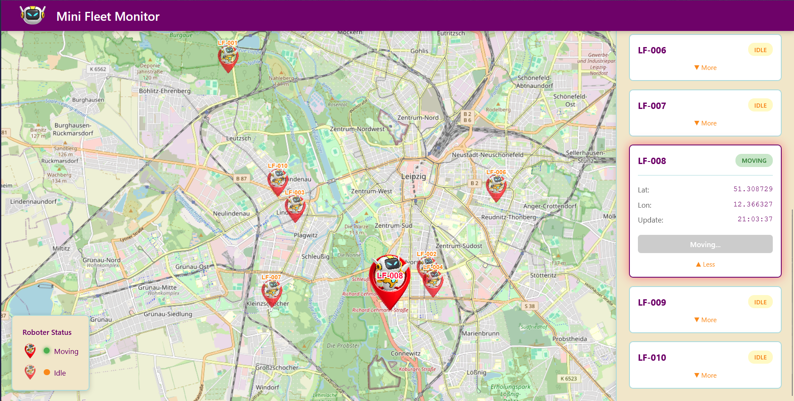

# Mini-Fleet Monitor

A small web app for monitoring virtual robots on a map. You can see them move around Leipzig in real time.

## Screenshots



## Architecture

React frontend talks to a Node.js/Express backend. The backend handles auth (JWT), serves robot data over REST, and pushes live position updates through WebSocket. Postgres stores users and robots, Redis is used for caching the robot list and also as a Pub/Sub broker so WebSocket knows when to send updates. When you move a robot it does 10 small steps over ~2s, each step gets saved to DB, pushed to Redis, and forwarded to the browser. The frontend picks that up and animates the marker on the map. Everything runs in Docker.

```
   Browser (React + OpenLayers)
      |          |
      | REST     | WebSocket
      v          v
   Express (Node.js / TypeScript)
      |          |
      | SQL      | Pub/Sub + Cache
      v          v
   PostgreSQL   Redis
```

## Setup

```bash
git clone https://github.com/danhcon123/mini-fleet-monitor.git
cd mini-fleet-monitor
```

### Option A: Docker (recommended)

You need Docker & Docker Compose.

```bash
docker-compose up --build -d
```

That starts everything:

| Service    | URL                        |
|------------|----------------------------|
| Frontend   | http://localhost:5173       |
| Backend    | http://localhost:3000       |
| PostgreSQL | localhost:5432              |
| Redis      | localhost:6379              |

Open `http://localhost:5173` and you're good to go.

To stop it:

```bash
docker-compose down
```
(Demo Login below)

### Option B: Run it locally

You need Node.js (v20+), PostgreSQL and Redis running.

1. **Start Postgres and Redis** (easiest way is still Docker for just these two):
    ```bash
    docker-compose up db redis -d
    ```

2. **Run the migrations** (only needed if you didn't use Docker for db before):
    ```bash
    psql -U admin -d mini_fleet_db -f backend/migrations/001_init.sql
    psql -U admin -d mini_fleet_db -f backend/migrations/002_seed.sql
    ```

3. **Backend:**
    ```bash
    cd backend
    cp env_example .env
    npm install
    npm run dev
    ```

4. **Frontend** (open another terminal):
    ```bash
    cd frontend
    cp env_example .env
    npm install
    npm run dev
    ```

Frontend runs on `http://localhost:5173`, backend on `http://localhost:3000`.

### Demo Login

| Email               | Password |
|---------------------|----------|
| admin@example.com   | admin    |

## Features

**Auth**
- Login with email/password, get a JWT back
- All API routes are protected with auth middleware
- Token saved in localStorage

**Map**
- OpenLayers map showing Leipzig area with robot markers
- Markers are green when moving, orange when idle
- Robots glide smoothly to new positions (animated with requestAnimationFrame)
- Click on a marker to highlight it and see its details in the sidebar

**Sidebar**
- Shows all robots with their status
- Click to expand and see lat/lon, last update time
- "Move" button sends the robot to a random location, button greys out while its moving
- Clicking a robot in the sidebar zooms the map to it

**Live Updates**
- WebSocket connection (authenticated with JWT)
- Backend publishes position changes to Redis, WS handler picks them up and sends to all clients
- Each move is 10 steps so you get a smooth animation, not just a jump
- Status and coordinates in the sidebar update in real time too

**Caching**
- Robot list is cached in Redis for 10s
- Cache gets cleared whenever a robot moves

## Tech Stack

**Backend:** Node.js, Express, TypeScript, PostgreSQL, Redis, ws, JWT

**Frontend:** React, OpenLayers, Axios, WebSocket
